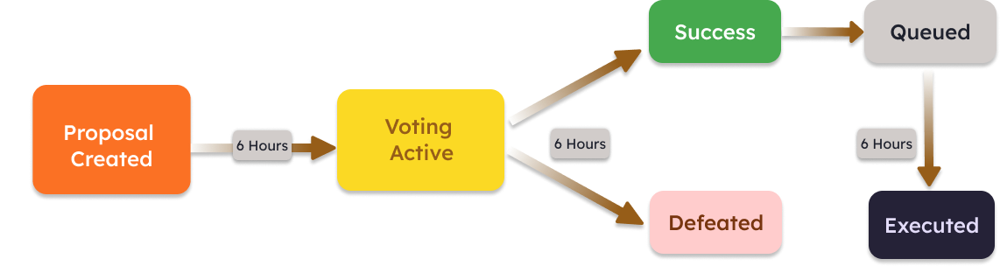

在 Berachain 上，治理由$BGT 代币投票决定。Berachain 的治理机制模仿了 OpenZeppelin 的治理模块。

Berachain 的治理模块拥有广泛的权力范围，包括对以下事项的控制：

- PoL 资产白名单（例如，新的质押资产，白名单激励资产）
- $HONEY 铸造参数（例如，符合条件的抵押资产，铸造速率）
- 本地 dApp 治理（例如，更改 Bend 的利率模型）
  - Berps
  - Bend
  - Bex

# 提案生命周期

治理提案的生命周期如下：

1. 创建提案
2. 等待期（6 小时），此后会进行一次代币持有快照
3. 投票开始，持续 6 小时
4. 超过法定门槛的多数投票将在 6 小时时间锁定后触发提案的变更

# $BGT 投票

用户钱包中的$BGT 代币余额用于确定投票权力：1 $BGT = 1 票

因此，持有的$BGT越多，在Berachain生态系统中拥有的治理权力也越大。$BGT 持有者能够将其投票权力委托给任意地址。

在 bArtio 测试网上，治理目前通过 Tally 进行。
