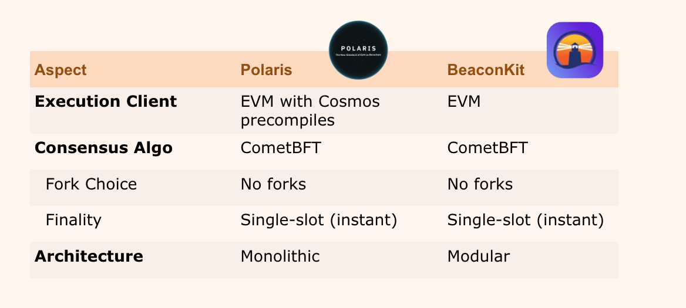

BeaconKit 是一个模块化且可定制的以太坊区块链共识层。

BeaconKit 引入了一个创新的框架，利用 Cosmos-SDK 创建一个灵活、可定制的共识层，专为以太坊区块链量身定制。该框架提供了构建和运行 EVM 区块链的最用户友好方式，同时确保与以太坊主网功能完全相同的执行环境。

最初是 EVM 兼容性；接着是 EVM 等效性；而现在通过 BeaconKit，实现了 EVM 相同性。

查看[官方 BeaconKit GitHub 仓库](https://github.com/berachain/beacon-kit)。

# BeaconKit 好在哪里？

Berachain V1（使用 Polaris）是一个紧密耦合的 EVM 执行，将 Cosmos 共识集成为单一二进制文件。随着 Berachain V1 测试网经历的极高交易量，显然这种方法无法扩展。

BeaconKit 提供了一个模块化的构建块，通过 CometBFT 共识算法提供单槽最终性。开发者可以使用 BeaconKit 运行任何实现 EngineAPI 的 EVM 执行客户端。

## Polaris 和 BeaconKit 的比较

# 支持的执行客户端

在基本实现中，BeaconKit 支持当今所有以太坊执行客户端。事实上，Berachain 的 V2 测试网支持所有主要的六种以太坊执行客户端：

- Geth：以太坊协议的官方 Go 实现。
- Erigon：性能更高、功能更丰富的客户端，是从 go-ethereum 分支出来的。
- Nethermind：基于 .NET 的客户端，完全支持以太坊协议。
- Besu：企业级客户端，使用 Apache 2.0 许可，用 Java 编写。
- Reth：基于 Rust 的客户端，专注于性能和可靠性。
- Ethereumjs：由以太坊基金会管理的基于 JavaScript 的客户端。

这种架构允许以太坊 DApp 开发者无缝集成到 Berachain 上。

## 模块化优势

虽然以上执行客户端作为 Berachain 的逻辑起点，但并不一定非要使用它们。BeaconKit 的模块化还能够在未来轻松地整合执行客户端的创新，只要它们实现了 Engine API。

这使得 BeaconKit 能够专注于提供最佳的共识构建块，让 EVM 和执行研究能够独立进行，同时还能利用这些增强功能。

# 运行本地开发网络

有关在本地运行 Berachain 的信息，请参考运行节点。
