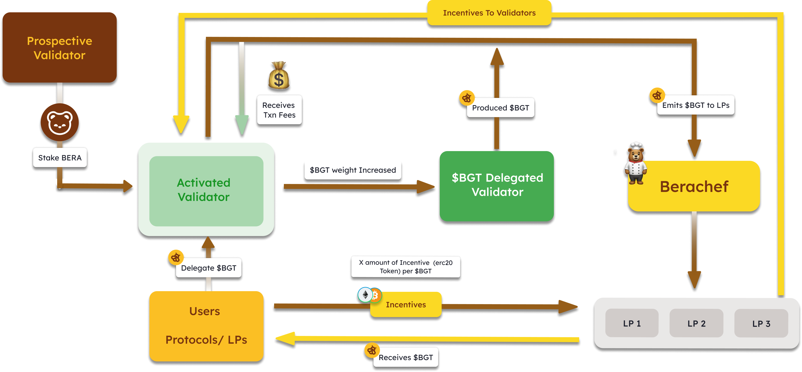

Berachain 的流动性证明（Proof-of-Liquidity，PoL）是一种顶尖的区块链治理方法，旨在通过一种创新的经济激励方式解决去中心化网络所面临的挑战。该模型侧重于解决两个主要目标：

1. 建立系统性流动性
2. 对齐利益相关者

这通过三代币模型（$BERA, $BGT, $HONEY）来实现，将负责燃料费和安全性的代币（$BERA）与用于治理和链上激励的代币（$BGT）分开。

# 权益证明（Proof of Stake, PoS）与流动性证明（Proof of Liquidity, PoL）

## 权益证明

权益证明（Proof of Stake, PoS）是一种共识机制，代币持有者可以将网络代币作为抵押进行“质押”。这些质押者有机会根据质押的代币数量提议新的区块，并获得相应的奖励。委托权益证明（Delegated Proof of Stake, DPoS）是 PoS 的一种变体，允许网络参与者将其投票权委托给验证者。

### PoS 的缺点

- 提高链的安全性会导致链上的可用流动性减少（因为验证者会锁定代币进行质押）。
- 协议几乎没有机会改善它们所构建的链的安全性。
- 验证者从他们最终运行基础设施的协议中获得的收益很少。

# 流动性证明

流动性证明（Proof of Liquidity, PoL）扩展了权益证明（PoS）并解决了其缺点。让我们来看一下 PoL 的工作原理：

1. 潜在的验证者必须提供 $BERA 作为保证金，才能有资格生成区块，并在被选中提议区块时将 $BGT 的发行量引导到他们选择的池中。

2. 通过提供 DeFi 流动性，用户可以赚取 $BGT，这是用于控制链上激励和通胀的治理代币。

3. 所有验证者都有平等的机会生成区块。然而，每个区块所发出的 $BGT 数量与委托给提议验证者的 $BGT 数量成正比。

4. 协议可以提供激励措施，鼓励验证者将 $BGT 的发行量引导到他们的池中，这些激励措施会回流到 $BGT 的委托人。

# 关注点分离

$BGT 是不可转让的，只能通过提供流动性这一机制获得，如上所述。$BERA 的发行只能通过单向过程燃烧 $BGT 来获得。

因此，那些选择参与决定链上激励流向的人（使用 $BGT）放弃了为链的安全性做贡献的能力（使用 $BERA）。这种关注点分离是 PoL 的一个关键特性，提高了生态系统参与者的效能。

# 通胀去中心化

向流动性提供者发放新的 $BGT 也是流动性证明（Proof of Liquidity）解决权益证明（Proof of Stake）第二个问题，即权益集中化的方式。现在，权益不再直接回到质押者手中，而是分配给执行常见链上操作的独立市场参与者，新代币的通胀量比传统的权益证明网络更公平地分配。

# 对齐协议和验证者

最后，流动性证明（Proof of Liquidity）同时解决了权益证明（Proof of Stake）的第三和第四个问题，通过激励协议和验证者合作来实现以下目标：

- 让验证者通过 $BGT 激励协议的流动性提供（LP）池。
- 让协议通过重新委派根据提供的激励积累的 $BGT 帮助这些验证者积累发放到池中的 $BGT 奖励。
