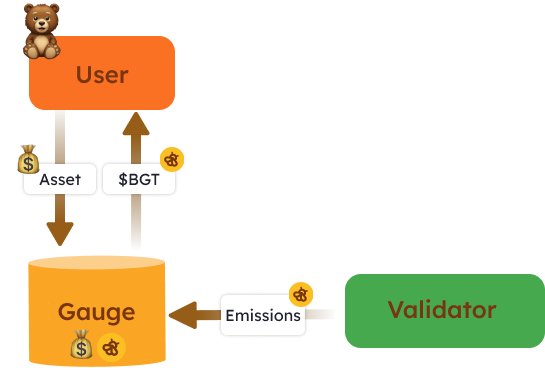

Gauges 是智能合约，用户可以将他们符合流动性证明 (Proof of Liquidity, PoL) 资格的资产质押到这些合约中，以获得 $BGT 奖励。Gauges 是唯一可以让任何人赚取 $BGT 奖励的途径，因此它们在 PoL 生态系统中起到了重要的入口作用。

> 每个符合 PoL 资格的资产都有一个不同的 Gauge 合约。

# 用户交互

用户从 Gauges 中获得的 $BGT 奖励数量取决于以下因素：

1. 用户在该 Gauge 中质押资产的份额
2. 向该 Gauge 发放的 $BGT 奖励数量

在 Gauge 中质押资产后，用户可以随时领取已赚取的奖励、增加存款或提取资产。

通过 Gauges 进行 $BGT 农业（farming）的设计类似于用户熟悉的 DeFi 操作，降低了普通用户的参与门槛。

# $BGT 如何进入 Gauges

验证者投票决定将他们的部分 $BGT 发放到特定的 Gauges。

要了解为什么验证者会选择将 $BGT 发放到某个特定的 Gauge 而不是其他 Gauge，请参阅 PoL 中的激励机制，其中讨论了协议如何通过经济激励来影响验证者的行为。

# 新 Gauge 的创建

新 Gauge 是通过 $BGT 治理进行的 Gauge 白名单过程创建的。开发者或协议可以提交提案，为特定的符合 PoL 资格的资产创建新的 Gauge。如果提案通过，将创建新的 Gauge 并添加到验证者可以发放 $BGT 的批准 Gauge 列表中。

关于如何提交白名单提案的更多信息将在不久的将来提供。
