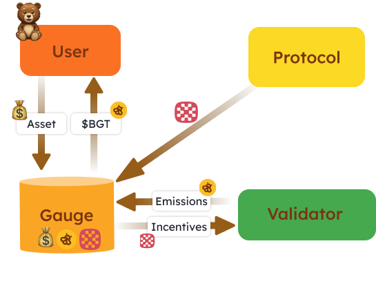

PoL 中的激励机制可以被定义为验证者 $BGT 发放的一个创造性且可定制的市场。

简化来看，整个激励系统就像是一个悬赏公告板，验证者可以选择哪些激励/Gauge 值得他们发放通过提议区块获得的 $BGT。

# 验证者的激励

$BGT 奖励通过 Gauges 分配给流动性提供者。下面是 Gauges 部分图示的扩展视图，另外显示了协议向 Gauges 提供激励。

一旦活跃的验证者生成了一个区块并发放 $BGT，他们可以决定将奖励发放给哪些 Gauges。协议向 Gauges 提供的激励则按验证者向 Gauge 发放的 $BGT 数量成比例地奖励给验证者。

> 警告: 上图仅从概念上说明了资产流向和从 Gauges 流出的过程。这不是基于合约的概述。

总结来说，Gauges 中的资产和用户流动可以描述如下：

1. 用户 → 将资产存入 Gauge
2. 协议 → 将激励存入 Gauge
3. 验证者 → 将 $BGT 发放到 Gauge
4. Gauge → 向提供资产的用户发放 $BGT
5. Gauge → 向发放 $BGT 的验证者发放激励

# 如何创建激励提案？（进行中 - 由于第三方未确定）

激励只能通过治理投票成功后创建。生态系统、用户和基金会根据他们自己的尽职调查决定提案。

要了解如何创建提案，...

# 激励的标准

在协议提供激励之前，激励资产必须首先通过 $BGT 治理提案列入白名单（通常与 Gauge 白名单提案同时进行）。每个 Gauge 有最多三个激励资产的限制，尽管这一限制可能会有所变化。

在创建激励时，激励提供者必须：

1. 指定每发放 1 $BGT 验证者将获得的激励数量
2. 将激励资产提供给 Gauge

# 例子

- Berachain 基金会希望激励 $bHONEY Gauge

- 他们提供 1 $wBTC，10 $wETH，和每发放 1 $BGT 到 Gauge 的 100 $sgtUSDC。

- 一个向 Gauge 发放 0.5 $BGT 的验证者将获得 0.5 $wBTC，5 $wETH，和 50 $sgtUSDC 作为奖励。

总结，任何人都可以提供激励，只要...

- Gauge 至少有一个列入白名单的激励对（例如：每发放 1 $BGT 对应 1 $wBTC）。
- 提供的激励符合最低激励率（按激励资产定义）。
