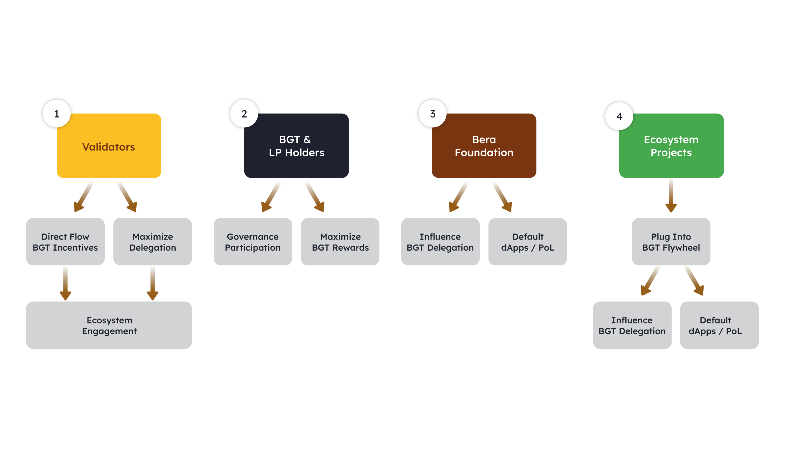

Proof-of-Stake 的主要缺陷之一是不同生态系统参与者之间缺乏协作的激励。验证者几乎没有理由与他们最终为之运行基础设施的协议和终端用户互动，但他们却获得了大部分经济激励。

流动性证明 (Proof-of-Liquidity, PoL) 则不同，它涉及到链上所有参与者的影响。PoL 要求不同的利益相关者同步工作，以最大化链上的流动性，从而获得最大的利益。

下图显示了 PoL 生态系统中不同参与者的分解。

# 验证者

验证者彼此协调以就区块链的状态达成共识。为了获得网络奖励，验证者必须将资产质押，并可能因不当行为而受到惩罚。成为活跃验证者需要质押 $BERA 代币。验证者通过两种主要方式赚取收入：

1. 燃料费和优先费
2. 收集协议提供的奖励，将 $BGT 奖励分配给他们选择的流动性池

第一点很简单，与以太坊 PoS 相同。第二点则是 PoL 机制的有趣之处。

## 验证者激励

如 $BGT 所述，每个区块的提议验证者根据其 $BGT 委托权重分配 $BGT 奖励。每个区块的提议验证者有权将该区块的 $BGT 奖励分配给他们选择的任何流动性池，并收集协议提供的任何相关激励。任何验证者都有平等的机会提议一个区块。

验证者的 $BGT 委托权重初始为 0，因此验证者在提议区块时不会将 $BGT 分配给流动性池（初始）。然而，通过证明他们正在寻找最有利可图的流动性池来分配 $BGT，并将部分奖励传递给 $BGT 委托人，他们可以吸引更多的委托。

## 生态系统对齐

PoL 中的验证者不仅仅是“验证”网络，他们还有机会与协议合作，促进 Berachain 上的流动性。最后，他们必须赢得用户（即 $BGT 持有者和农民）的青睐，以有效分配 $BGT 奖励给流动性池并获得激励。

# $BGT 持有者和农民

$BGT 持有者在以下方面发挥关键作用：

- 通过治理影响生态系统决策
- 通过委托给验证者影响 Berachain 的经济激励方向

> 注意： 委托给验证者的 $BGT 不受削减风险影响。只有验证者的 $BERA 质押会被削减。

## 赚取 $BGT

作为一个寻求赚取 $BGT 的农民，我会根据我的风险和资产暴露情况寻找最有利可图的流动性池。这意味着我会寻找那些从满足我标准的验证者那里获得最多 $BGT 奖励的流动性池。例如，如果我只想要稳定币暴露，我可能会通过为 Berps 协议提供 $HONEY 流动性来赚取 $BGT。

## 委托 $BGT

现在我有了 $BGT，不同的因素可能会影响我如何选择委托它：

- 我可能会将 $BGT 委托给那些将 $BGT 奖励分配给我正在耕作的流动性池的验证者（以提高我的收入）。
- 我可能会将 $BGT 委托给那些最大化流动性池激励收入，并将最大价值传递给其委托人的验证者。

# Bera 基金会

基金会在运营原生 dApps（Bex、Bend、Berps）方面发挥作用，这些 dApps 产生的费用分配给 $BGT 持有者（从而独立于流动性池激励，产生对赚取 $BGT 的原生需求）。

这些默认 dApps 中的流动性也作为用户提供流动性并赚取 $BGT 的默认流动性池，直到其他协议的流动性池通过治理接入 PoL。

# 生态系统项目

PoL 代表了协议引导存款的一种新方法，相比传统的通过流动性挖矿激励流动性。通过接入 PoL，协议可以通过激励 $BGT 奖励（来自验证者）流向其流动性池来促进流动性。

所有链上的参与者都致力于增加网络的整体价值，因为所有奖励都围绕 $BGT。如果 $BGT 激励的价值上升，项目的代币（作为流动性池的激励提供）也可能随着存款的增加而相应增加价值。

最后，新的生态系统项目需要成为活跃参与者，并赢得 $BGT 持有者和委托人的青睐，以使他们的流动性池被列入 PoL 系统的白名单。
