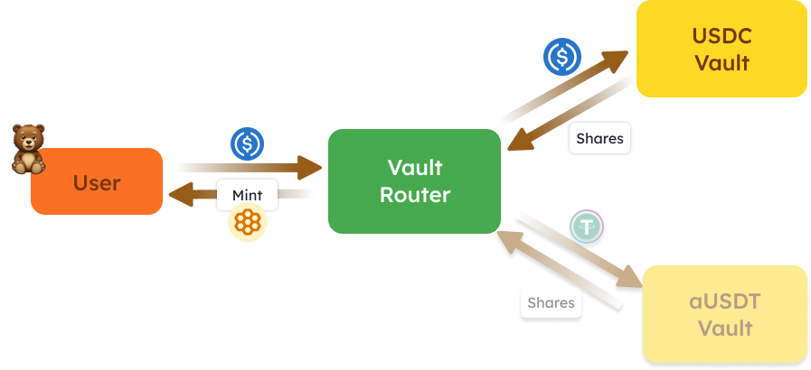

$HONEY是Berachain的原生稳定币，旨在提供一个稳定可靠的交易媒介，不同于交易波动较大的加密资产。稳定性是交换媒介中的一个理想属性。$HONEY 的目标是与 1 美元保持固定汇率。

# $HONEY 是什么？

$HONEY 是一个完全抵押的稳定币，软锚定美元。$HONEY 可以通过多样化的加密资产抵押（并从中铸造）进行支持。这种多抵押物的方法增强了$HONEY 的稳定性和韧性。

# 如何获取$HONEY？

可以通过将白名单抵押品存入保险库，并针对该抵押品铸造$HONEY 来获取它。不同的资产作为$HONEY 的抵押品存放在不同的保险库合约中。每种不同抵押品的$HONEY 铸造速率由$BGT 治理进行配置。

另外，也可以通过在 Berachain Bex 上交易其他资产来获取$HONEY。

# $HONEY 的使用方式？

$HONEY 可以像其他稳定币一样用于支付/汇款，以及作为对抗市场波动的对冲工具。然而，在 Berachain 生态系统内，$HONEY 还有一些独特的用途，包括：

## 借贷 - Bend

Bend 通过让用户向 bend 的$HONEY流动性池添加资金，并通过提供资金来赚取利息来使用$HONEY。

供应其$HONEY的用户将收到等值的$aHONEY 代币。

$HONEY 是 Bend 接受的唯一资产，可以用来赚取利息。

## 永续期货 - Berps

Berps 将$HONEY作为所有交易抵押品、支付和存款的基础代币。例如，为了进入ETH的杠杆长期头寸，必须首先存入相应数量的$HONEY。

另外，$HONEY持有者可以通过向$bHONEY 保险库提供交易流动性而被动赚取收益。$bHONEY保险库的存款人从Berps生成的交易费中获得收益，并充当交易者头寸的交易对手。例如，如果某个交易者被清算，该头寸的$HONEY 抵押将分配给在$bHONEY 保险库中的存款人。

## 铸造$HONEY

下面是$HONEY 铸造过程的流程图：HONEY 铸造

## $HONEY 保险库

$HONEY 通过将符合条件的抵押品存入称为$HONEY 保险库的专门智能合约来铸造。每个保险库针对特定的抵押品类型，具有其独特的铸造和赎回速率。

在上述示例中，用户存入 USDC 来铸造$HONEY。只有与之交互的是 USDC 保险库，而不是 aUSDT 保险库。

## 保险库路由器

$HONEY铸造过程的核心是保险库路由器合约。该合约充当中央枢纽，连接所有不同的$HONEY 保险库，并负责铸造新的$HONEY 代币。

如图所示，用户的存款通过保险库路由器合约路由到适当的保险库。保险库路由器保存与保险库铸造的份额（对应用户存款），并向用户铸造$HONEY 代币。

## 费用

从铸造和赎回$HONEY收取的费用分配给$BGT 持有者。费用根据每个保险库的铸造和赎回速率确定。例如，如果 USDC 保险库的铸造速率为 0.995（1 USDC 对应 0.995 $HONEY），那么每存入 1 USDC 收取 0.5%或 0.005 的费用。

### 示例

让我们考虑以下参数的示例：

- 用户希望存入 1,000 USDC
- USDC 的铸造速率设置为 0.995（99.5%）

铸造过程如下：

1. 用户将 1,000 USDC 存入保险库路由器合约
2. 保险库路由器将 1,000 USDC 转入 USDC 保险库，并收到 1,000 保险库份额
3. 保险库路由器计算要铸造的 HONEY 数量：

- 要铸造的 HONEY = 保险库份额 × 铸造速率
- 要铸造的 HONEY = 1,000 × 0.995 = 995 HONEY

4. 保险库路由器向用户地址铸造 995 个 HONEY
5. 保险库路由器计算并分配费用：

- 费用份额 = 保险库份额 - 要铸造的 HONEY
- 费用份额 = 1,000 - 995 = 5 份额
- 保险库路由器将 5 份保险库份额转给费用接收者。
