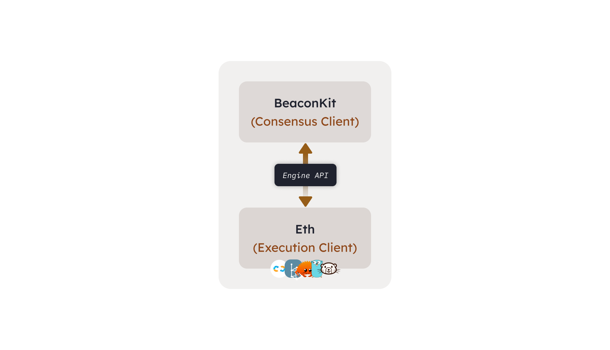

Berachain 协议是一个与 EVM 完全相同的区块链，旨在通过采用流动性证明共识机制，成为流动性方面最有效的 EVM 之一。

# 共识层

Berachain 协议建立在 BeaconKit 之上，利用 CometBFT 将共识层分离，并调整以支持以太坊执行客户端。

共识客户端（BeaconKit）的主要作用是通过 Engine API 就来自以太坊执行客户端的区块数据达成共识。

# 执行层

Berachain 利用现有的以太坊执行客户端，连接到丰富的 EVM 生态系统中的研究人员和工具。

这意味着任何以太坊执行客户端（如 Geth、Reth 等）都可以直接使用，无需任何修改，并与 BeaconKit 配对。

# 代币

Berachain 使用三种本链的主要代币。

## $BERA

Berachain 协议的主要燃料费代币，同时也是验证者的激活保证金（需要通过治理决定的 x $BERA 被质押以成为“活跃”验证者）。

## $BGT

Berachain 治理代币 $BGT 是本链的治理代币，通常通过池子奖励给直接委托人和特定的流动性提供者（LP）。当验证者提议一个新区块时，会获得一些 $BGT，并将这些 $BGT 分配给特定的委托人和流动性池。

$BGT 是不可转让的，只能通过验证者奖励获得，可以与验证者一起质押，用于治理提案，并可以烧毁以获得 Berachain 的本地燃料费代币 $BERA。

了解更多关于 $BGT 的信息。

## $HONEY

Berachain 的稳定币，是大多数 Berachain 原生 dApps 使用的规范代币。

了解更多关于 $HONEY 的信息。

# Berachain DApps

Berachain 有一系列原生 dApps（BEX、Berps 和 Bend），它们是 PoL 框架的实现，用户可以提供流动性并有资格接收 $BGT 的发放。

- **BEX**: Berachain 的本地去中心化交易所。
- **Bend**: Berachain 的本地借贷交易所。
- **Berps**: Berachain 的本地永续协议实现。
- **Honey Swap**: Berachain 的本地稳定币 $HONEY 的交换。
- **BGT Station**: Berachain 的本地 DApp，用于管理您的 $BGT 奖励。
- **Beratrail**: Berachain 的本地区块浏览器。
- **Faucet**: Berachain 的本地水龙头，用于 $BERA（燃料费代币）。
